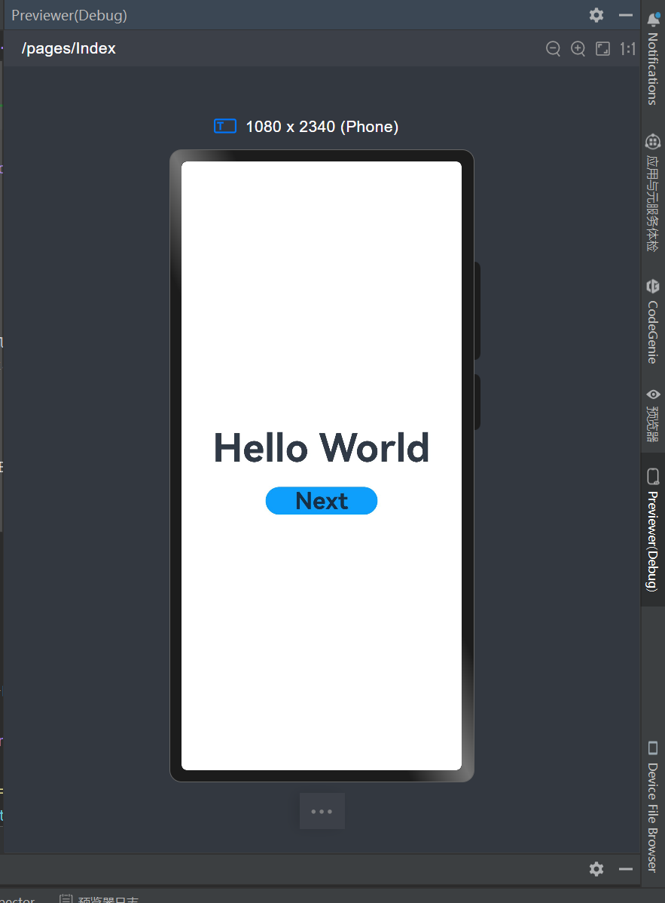
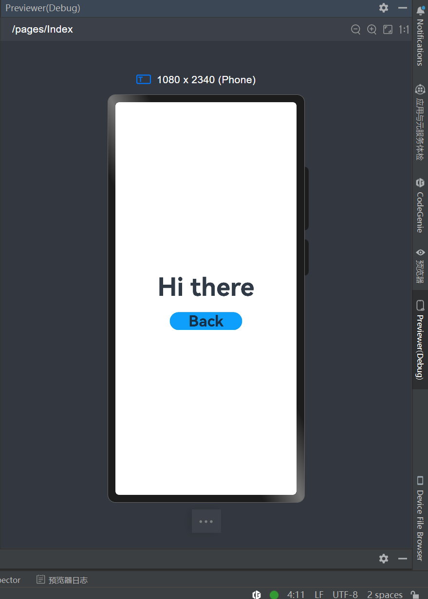
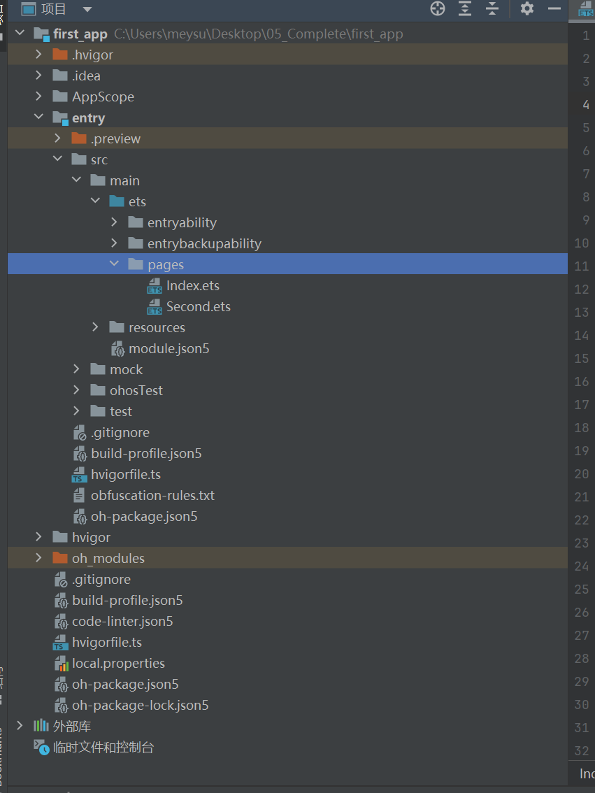
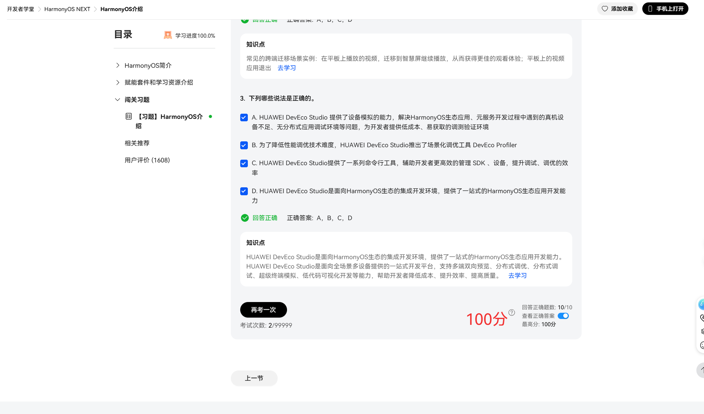
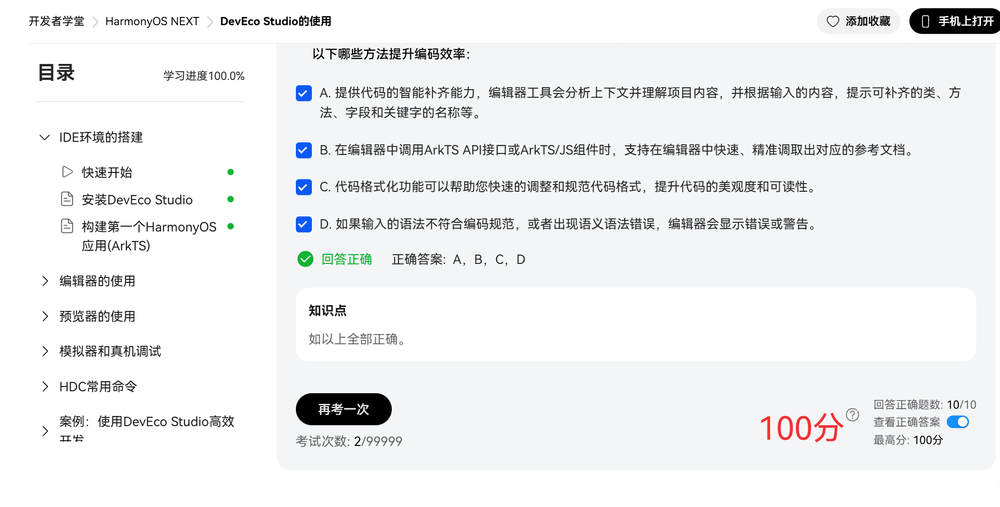

<h1 align="center">桂林电子科技大学</h>

<h3 align="center">移动应用开发 实验报告</h3>

<table style="undefined;table-layout: fixed; width: 720px">
<colgroup>
    <col style="width: 100px">
    <col style="width: 200px">
    <col style="width: 60px">
    <col style="width: 100px">
    <col style="width: 60px">
    <col style="width: 200px">
</colgroup>
<tbody>
    <tr>
        <td>实验名称</td>
        <td colspan="3">实验一 熟悉DevEco Studio开发环境</td>
        <td rowspan="3">评语</td>
        <td rowspan="3"></td>
        </tr>
    <tr>
        <td>院系</td>
        <td>计算机与信息安全学院</td>
        <td>专业</td>
        <td>软件工程</td>
    </tr>
    <tr>
        <td>学号</td>
        <td>2300320103</td>
        <td>姓名</td>
        <td>苏梅</td>
    </tr>
    <tr>
        <td>实验日期</td>
        <td colspan="2">2025年6月29日</td>
        <td></td>
        <td>成绩</td>
        <td></td>
    </tr>
</tbody>
</table>

### 一、实验目的

1. 掌握DevEco Studio创建工程的方法;
2. 掌握HarmonyOS应用Stage模型工程目录结构;
3. 掌握ArkUI基本组件(`Button`, `Text`)、布局(`Column`)的使用方式; 
### 二、实验内容

> **基本要求**
> 1. 代码采用markdown标准代码块语法进行显示；
> 2. 实验运行结果截图采用虚拟机中的截图按钮，仅截取屏幕内容，不可采用第三方IM的截图功能。运行结果截图需配上图编号、图标题。

<!-- 代码标题、图标标题必须使用**进行加粗显示-->
**代码1. Index.ets**
在第一个页面中，跳转按钮绑定onClick事件，单击按钮时跳转到第二页。Index.ets文件如下：
```ts
// Index.ets
// 导入页面路由模块
import { BusinessError } from '@kit.BasicServicesKit';

@Entry
@Component
struct Index {
  @State message: string = 'Hello World';

  build() {
    Row() {
      Column() {
        Text(this.message)
          .fontSize(50)
          .fontWeight(FontWeight.Bold)
        // 添加按钮，以响应用户onClick事件
        Button() {
          Text('Next')
            .fontSize(30)
            .fontWeight(FontWeight.Bold)
        }
        .type(ButtonType.Capsule)
        .margin({
          top: 20
        })
        .backgroundColor('#0D9FFB')
        .width('40%')
        .height('5%')
        // 跳转按钮绑定onClick事件，单击时跳转到第二页
        .onClick(() => {
          console.info(`Succeeded in clicking the 'Next' button.`)
          // 获取UIContext
          let uiContext: UIContext = this.getUIContext();
          let router = uiContext.getRouter();
          // 跳转到第二页
          router.pushUrl({ url: 'pages/Second' }).then(() => {
            console.info('Succeeded in jumping to the second page.')

          }).catch((err: BusinessError) => {
            console.error(`Failed to jump to the second page. Code is ${err.code}, message is ${err.message}`)
          })
        })
      }
      .width('100%')
    }
    .height('100%')
  }
}
```
**代码2. Second.ets代码**
在`Index.ets`文件中添加`Text`组件。
在第二个页面中，返回按钮绑定onClick事件，单击按钮时返回到第一页。Second.ets文件如下：
```ts
// Second.ets
// 导入页面路由模块
import { BusinessError } from '@kit.BasicServicesKit';

@Entry
@Component
struct Second {
  @State message: string = 'Hi there';

  build() {
    Row() {
      Column() {
        Text(this.message)
          .fontSize(50)
          .fontWeight(FontWeight.Bold)
        Button() {
          Text('Back')
            .fontSize(30)
            .fontWeight(FontWeight.Bold)
        }
        .type(ButtonType.Capsule)
        .margin({
          top: 20
        })
        .backgroundColor('#0D9FFB')
        .width('40%')
        .height('5%')
        // 返回按钮绑定onClick事件，单击按钮时返回到第一页
        .onClick(() => {
          console.info(`Succeeded in clicking the 'Back' button.`)
          // 获取UIContext
          let uiContext: UIContext = this.getUIContext();
          let router = uiContext.getRouter();
          try {
            // 返回第一页
            router.back()
            console.info('Succeeded in returning to the first page.')
          } catch (err) {
            let code = (err as BusinessError).code; 
            let message = (err as BusinessError).message; 
            console.error(`Failed to return to the first page. Code is ${code}, message is ${message}`)
          }
        })
      }
      .width('100%')
    }
    .height('100%')
  }
}
```
{width="280px"}
**图1. 第一个页面**


{width="280px"}
**图2. 第二个页面**


{width="280px"}
**图3. Harmony应用工程结构**  


{width="700px"}
**图4. HarmonyOS简介**


{width="700px"}
**图5. IDE环境的搭建**


### 三、实验总结

#### 遇到的问题
1. 编写页面跳转代码时，调用`router.pushUrl`方法时提示“router未定义”，跳转功能无法实现。
2. `Button`组件用固定像素设置宽高时，在模拟器中显示比例失调，要么过大要么过小，和页面整体不协调。

#### 解决方法
1. 对于router未定义的问题，重新查看官方文档，发现是获取路由实例的步骤缺失，补全`this.getUIContext().getRouter()`代码后，成功获取路由实例，跳转功能恢复正常。
2. 按钮样式问题，将宽高属性从固定像素（如`width: 200`）改为百分比（如`width: '40%'`），同时调整`margin`值，按钮在模拟器中显示比例变得合适。

#### 收获
1. 掌握了DevEco Studio创建HarmonyOS工程的完整步骤，对Stage模型的目录结构有了清晰认识，知道不同文件该放在哪个文件夹里。
2. 学会了`Text`、`Button`组件的基本用法，能通过属性设置样式，也能给按钮绑定`onClick`事件实现交互。
3. 理解了页面路由的基本原理，会用`pushUrl`和`back`方法实现页面跳转和返回，对HarmonyOS应用的页面交互逻辑有了初步概念。
4. 意识到开发中细节的重要性，比如路径拼写、代码逻辑完整性都会影响功能实现，以后写代码会更注意检查细节，遇到问题先查文档再调试。

### 四、实验代码


